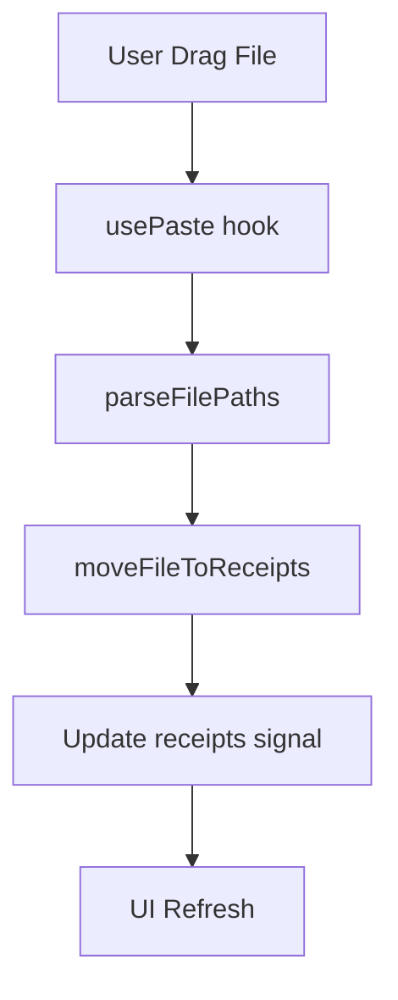

# AGENTS.md - lesentiel
Generated: 2026-02-01 | Branch: main

## 🏗 STRUCTURE
```text
src/
├── index.tsx              # Entry, state, usePaste()
├── components/            # UI: AppLayout, Header, ReceiptList, Footer
└── utils/                 # Logic: fileParser.ts, receipts.ts (+ .test.ts)
```

## 🛠 COMMANDS
| Action | Command |
| :--- | :--- |
| Dev (Hot-reload) | `bun dev` |
| Run (No reload) | `bun run src/index.tsx` |
| Test (All) | `bun test` |
| Test (Single) | `bun test src/utils/fileParser.test.ts` |
| Type Check | `bun run tsc --noEmit` |
| Install | `bun install` |

## 🚫 ANTI-PATTERNS
| ❌ NEVER | ✅ INSTEAD |
| :--- | :--- |
| `process.exit()` | `renderer.destroy()` (restores terminal) |
| `<text bold>` | `<text><strong>Bold</strong></text>` |
| `<ascii-font>` | `<ascii_font>` (use underscores) |
| `{ value } = props` | `props.value` (keep reactive) |
| `receipts` | `receipts()` (call signals) |
| `files[0]` | `if (files[0]) { ... }` (null-check) |
| `import fs from "node:fs"` | `Bun.file()`, `Bun.write()` |
| `import React from "react"` | `import { ... } from "solid-js"` |

## 📜 CONVENTIONS

### Runtime & Imports
- **Runtime**: Bun (ESM only). Use `Bun.file()`, `Bun.Glob()`, `Bun.spawn()`.
- **Imports**: Include `.ts`/`.tsx` extensions. External first, then local.
```typescript
import { createSignal } from "solid-js";
import { parseFilePaths } from "./utils/fileParser.ts";
```

### TypeScript (Strict)
- `noUncheckedIndexedAccess`: Always null-check array access.
- Prefer type guards over assertions (`value!` is forbidden).
```typescript
const file = files[0];
if (file) { await process(file); } // REQUIRED
```

### OpenTUI & SolidJS
- **JSX**: `jsxImportSource: "@opentui/solid"`. Lowercase tags for primitives.
- **Text**: Use nested tags (`<strong>`, `<em>`, `<u>`, `<span>`) for styling.
- **Layout**: Use flexbox on `<box>` (`flexDirection`, `gap`, `padding`).
- **Reactivity**: Use `createSignal`, `onMount`. Don't destructure props.
- **Components**: PascalCase files/functions. Use `Props` suffix for types.
```typescript
export function Header(props: HeaderProps) {
  return (
    <box flexDirection="column">
      <ascii_font text="Receipts" />
      <text><span>Status: {props.status}</span></text>
    </box>
  );
}
```

### Testing
- **Framework**: `bun:test`. Colocated `.test.ts` files.
- **Cleanup**: Use `/tmp/` for test files. Clean in `afterEach`.
```typescript
afterEach(async () => {
  for (const f of testFiles) await Bun.spawn(["rm", f]).exited;
});
```

### Naming
| Entity | Convention | Example |
| :--- | :--- | :--- |
| Components | PascalCase | `AppLayout.tsx` |
| Utilities | camelCase | `fileParser.ts` |
| Functions | camelCase | `parseFilePaths` |
| Constants | SCREAMING_SNAKE | `RECEIPTS_DIR` |

## 🎯 AGENT SKILLS

When delegating tasks for this OpenTUI project, **ALWAYS** include these skills:

| Skill | When Required |
| :--- | :--- |
| `opentui` | **MUST USE** for any UI/component changes, layout, keyboard handling, or OpenTUI API usage |
| `bun-expert` | **MUST USE** for Bun runtime operations, package management, testing, or build config |
| `code-simplifier` | Use for refactoring, code cleanup, or improving maintainability |

### Usage Example
```typescript
delegate_task(
  category="visual-engineering",
  load_skills=["opentui", "bun-expert"],
  prompt="Add a new component..."
)
```

## 📐 ARCHITECTURE

1. **Main** (`index.tsx`): State management & event orchestration.
2. **UI** (`components/`): Pure layout and display components.
3. **Utils** (`utils/`): Pure logic for parsing and file operations.
